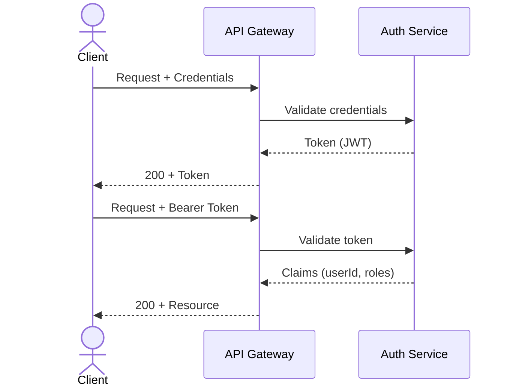

# API & Interface Specification

> **Document ID**: API-{PROJECT_ID}-001
> **Version**: 0.1.0 (Draft)
> **Last Updated**: {DATE}
> **Author**: {AUTHOR}
> **Status**: Draft | In Review | Approved | Deprecated
> **SDD Reference**: [SDD-{PROJECT_ID}-001](../specs/SDD.md)

---

## Quick Start

1. Define all public interfaces here — both external APIs and internal module contracts
2. Every endpoint must include request/response examples (not just schemas)
3. Error codes must be standardized across the project (Section 5)
4. Sub-agent dispatch protocols (harness) are documented in Section 4
5. Version changes require an ADR when breaking

---

## Table of Contents

1. [Overview](#1-overview)
2. [API Design Standards](#2-api-design-standards)
3. [Endpoints / Public Interfaces](#3-endpoints--public-interfaces)
4. [Internal Module Interfaces](#4-internal-module-interfaces)
5. [Error Handling Contract](#5-error-handling-contract)
6. [Authentication & Authorization](#6-authentication--authorization)
7. [Rate Limiting & Throttling](#7-rate-limiting--throttling)
8. [Versioning Policy](#8-versioning-policy)
9. [Harness Sub-Agent Communication Protocol](#9-harness-sub-agent-communication-protocol)
10. [Related Documents](#10-related-documents)

---

## 1. Overview

### 1.1 Purpose

This document defines all communication contracts for **{PROJECT_NAME}**: public APIs, internal module boundaries, sub-agent dispatch protocols, and error handling standards.

### 1.2 Base URLs

| Environment | Base URL |
|---|---|
| Development | `http://localhost:{PORT}/api/v{N}` |
| Staging | `https://staging.{DOMAIN}/api/v{N}` |
| Production | `https://{DOMAIN}/api/v{N}` |

### 1.3 Common Headers

| Header | Required | Description | Example |
|---|---|---|---|
| `Content-Type` | Yes | Request body format | `application/json` |
| `Accept` | Yes | Response format | `application/json` |
| `Authorization` | Conditional | Auth token | `Bearer {token}` |
| `X-Request-ID` | Recommended | Tracing correlation ID | `uuid-v4` |
| `X-API-Version` | Optional | API version override | `2` |

---

## 2. API Design Standards

### 2.1 Naming Conventions

| Aspect | Convention | Example |
|---|---|---|
| URL paths | lowercase, kebab-case, plural nouns | `/api/v1/user-profiles` |
| Query params | camelCase | `?pageSize=20&sortBy=createdAt` |
| Request body | camelCase | `{ "firstName": "John" }` |
| Response body | camelCase | `{ "userId": "abc-123" }` |

### 2.2 HTTP Methods

| Method | Purpose | Idempotent | Request Body |
|---|---|---|---|
| `GET` | Retrieve resource(s) | Yes | No |
| `POST` | Create resource | No | Yes |
| `PUT` | Full update / replace | Yes | Yes |
| `PATCH` | Partial update | No | Yes |
| `DELETE` | Remove resource | Yes | No |

### 2.3 Response Format Standard

```json
// Success response
{
  "status": "success",
  "data": { ... },
  "meta": {
    "page": 1,
    "pageSize": 20,
    "totalCount": 150
  }
}

// Error response
{
  "status": "error",
  "error": {
    "code": "VALIDATION_ERROR",
    "message": "Human-readable error description",
    "details": [
      {
        "field": "email",
        "message": "Invalid email format"
      }
    ]
  }
}
```

---

## 3. Endpoints / Public Interfaces

### 3.1 Endpoint Template

> Copy this block for each endpoint:

#### `{METHOD} /api/v{N}/{resource}`

| Attribute | Value |
|---|---|
| **Description** | {What this endpoint does} |
| **Authentication** | {Required / Optional / None} |
| **Authorization** | {Role required: Admin / User / Any} |
| **Rate Limit** | {100 req/min per user / Unlimited} |
| **SRS Requirement** | REQ-{MODULE}-{NNN} |

**Request Parameters**:

| Parameter | Location | Type | Required | Default | Description | Validation |
|---|---|---|---|---|---|---|
| `{param}` | {path / query / header} | {string / int / uuid} | {Yes / No} | {value / —} | {Description} | {min/max/pattern} |

**Request Body** (if applicable):

```json
{
  "field1": "string (required) — Description",
  "field2": 42,
  "nested": {
    "field3": true
  }
}
```

**Response** — `200 OK`:

```json
{
  "status": "success",
  "data": {
    "id": "abc-123",
    "field1": "value",
    "createdAt": "2026-01-01T00:00:00Z"
  }
}
```

**Response** — `400 Bad Request`:

```json
{
  "status": "error",
  "error": {
    "code": "VALIDATION_ERROR",
    "message": "field1 is required",
    "details": [{ "field": "field1", "message": "Cannot be empty" }]
  }
}
```

**Response** — `404 Not Found`:

```json
{
  "status": "error",
  "error": {
    "code": "NOT_FOUND",
    "message": "Resource with id 'xyz' not found"
  }
}
```

---

### 3.2 {Resource Name} Endpoints

#### `GET /api/v1/{resources}`

*(Use template from 3.1)*

#### `POST /api/v1/{resources}`

*(Use template from 3.1)*

#### `GET /api/v1/{resources}/{id}`

*(Use template from 3.1)*

#### `PUT /api/v1/{resources}/{id}`

*(Use template from 3.1)*

#### `DELETE /api/v1/{resources}/{id}`

*(Use template from 3.1)*

---

## 4. Internal Module Interfaces

### 4.1 Module Contract Template

#### Interface: `{ModuleName}Service`

| Attribute | Value |
|---|---|
| **Provider Module** | `{src/modules/provider}` |
| **Consumer Module(s)** | `{src/modules/consumer1, consumer2}` |
| **Communication** | {Direct import / Event bus / Message queue} |
| **SDD Component** | [Component: {Name}](../specs/SDD.md#component-name) |

**Methods**:

```
interface {ModuleName}Service {
  /**
   * {Description}
   * @param {paramName} - {description}
   * @returns {ReturnType} - {description}
   * @throws {ErrorType} - {when this error occurs}
   */
  {methodName}({params}): {ReturnType};
}
```

**Data Transfer Objects (DTOs)**:

```
interface {MethodName}Request {
  field1: string;   // {description}
  field2: number;   // {description, constraints}
}

interface {MethodName}Response {
  id: string;       // {description}
  status: string;   // {enum values}
}
```

---

## 5. Error Handling Contract

### 5.1 Error Code Registry

| Code | HTTP Status | Description | Retry? | User Action |
|---|---|---|---|---|
| `VALIDATION_ERROR` | 400 | Request payload fails validation | No | Fix input |
| `UNAUTHORIZED` | 401 | Missing or invalid auth token | No | Re-authenticate |
| `FORBIDDEN` | 403 | Insufficient permissions | No | Contact admin |
| `NOT_FOUND` | 404 | Requested resource doesn't exist | No | Verify ID |
| `CONFLICT` | 409 | Resource state conflict (e.g., duplicate) | No | Resolve conflict |
| `RATE_LIMITED` | 429 | Too many requests | Yes (after delay) | Wait and retry |
| `INTERNAL_ERROR` | 500 | Unexpected server error | Yes (with backoff) | Report issue |
| `SERVICE_UNAVAILABLE` | 503 | Dependency or service down | Yes (with backoff) | Wait and retry |

### 5.2 Error Response Schema

```json
{
  "status": "error",
  "error": {
    "code": "string (from Error Code Registry)",
    "message": "string (human-readable, safe to display)",
    "details": [
      {
        "field": "string (optional, for validation errors)",
        "message": "string (field-specific error)"
      }
    ],
    "traceId": "string (X-Request-ID for debugging)"
  }
}
```

---

## 6. Authentication & Authorization

### 6.1 Authentication Flow



### 6.2 Token Specification

| Attribute | Value |
|---|---|
| **Format** | {JWT / Opaque / API Key} |
| **Algorithm** | {RS256 / HS256} |
| **Expiry** | {1h / 24h} |
| **Refresh** | {7d / 30d / None} |
| **Claims** | `sub`, `roles`, `exp`, `iat` |

### 6.3 Role-Based Access Control (RBAC)

| Endpoint Pattern | Admin | Editor | Viewer | Anonymous |
|---|---|---|---|---|
| `GET /resources` | ✅ | ✅ | ✅ | ❌ |
| `POST /resources` | ✅ | ✅ | ❌ | ❌ |
| `PUT /resources/{id}` | ✅ | ✅ (own) | ❌ | ❌ |
| `DELETE /resources/{id}` | ✅ | ❌ | ❌ | ❌ |

---

## 7. Rate Limiting & Throttling

| Tier | Limit | Window | Response on Exceed |
|---|---|---|---|
| Anonymous | {30 req} | {1 min} | 429 + `Retry-After: {N}s` |
| Authenticated | {100 req} | {1 min} | 429 + `Retry-After: {N}s` |
| Premium / Internal | {1000 req} | {1 min} | 429 + `Retry-After: {N}s` |

**Rate Limit Headers**:

| Header | Description |
|---|---|
| `X-RateLimit-Limit` | Max requests per window |
| `X-RateLimit-Remaining` | Remaining requests in window |
| `X-RateLimit-Reset` | Unix timestamp when window resets |

---

## 8. Versioning Policy

### 8.1 Versioning Strategy

- **Method**: {URL path versioning (`/api/v1/`) / Header versioning / Query param}
- **Current Version**: `v{N}`
- **Deprecation Notice Period**: {3 months / 2 releases}

### 8.2 Breaking Change Definition

A change is considered **breaking** if it:
- Removes or renames an existing endpoint, field, or parameter
- Changes the type or format of an existing response field
- Adds a new required request parameter
- Changes the meaning of an existing error code
- Requires an ADR: [ADR-{NNN}](../decisions/ADR-{NNN}.md)

### 8.3 Version History

| Version | Release Date | Status | Major Changes |
|---|---|---|---|
| v1 | {DATE} | Active | Initial release |

---

## 9. Harness Sub-Agent Communication Protocol

### 9.1 Task Dispatch Contract

The harness dispatches tasks to sub-agents via task JSON files (`docs/tasks/{task_id}.json`):

| Field | Type | Purpose |
|---|---|---|
| `id` | string | Unique task identifier |
| `assigned_sub_agent` | `"QA" / "Dev" / "Doc" / null` | Target sub-agent role |
| `sub_task_status` | `"Pending" / "InProgress" / "Completed" / "Failed"` | Delegation lifecycle |
| `mechanical_dod.command` | string | Verification command to execute |
| `mechanical_dod.expected_exit_code` | int | Expected result |
| `depends_on` | string[] | Task IDs that must complete first |

### 9.2 Sub-Agent Permissions Matrix

| Sub-Agent | Can Modify `src/` | Can Modify `tests/` | Can Modify `docs/` | Can Modify `.harness/` |
|---|---|---|---|---|
| **QA** (RED) | ❌ | ✅ | ❌ | ❌ |
| **Dev** (GREEN) | ✅ | ✅ | ❌ | ❌ |
| **Doc** (DOCUMENT) | ❌ | ❌ | ✅ | ❌ |

### 9.3 Telemetry Communication

| Event | Producer | Consumer | Data |
|---|---|---|---|
| Test Complete | `harness.sh test` | `.harness/telemetry/{task_id}.log` | Exit code, coverage, duration |
| Status Update | `harness.sh test` | `docs/tasks/{task_id}.json` | Status, hash, metrics |
| Doc Sync | `harness.sh document` | `docs/architecture.md`, `docs/quality_metrics.md` | Generated docs |

---

## 10. Related Documents

| Document | Path | Relationship |
|---|---|---|
| Software Design Document | `docs/specs/SDD.md` | Architecture defining interfaces |
| Software Requirements Specification | `docs/specs/SRS.md` | Requirements driving API design |
| Software Configuration Specification | `docs/specs/SCS.md` | Environment-specific API config |
| Architecture Decision Records | `docs/decisions/ADR-*.md` | API versioning and design decisions |
