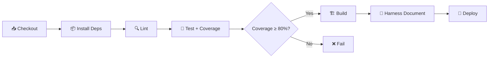

## 7. CI/CD Pipeline Configuration

### 7.1 Pipeline Stages

### 7.2 Pipeline Configuration

| Stage | Command | Timeout | Failure Action |
|---|---|---|---|
| Install | `{npm ci}` | 5 min | Fail pipeline |
| Lint | `{npm run lint}` | 2 min | Fail pipeline |
| Test | `{harness.sh test --id CI --cmd "c8 npm test"}` | 10 min | Fail pipeline |
| Build | `{npm run build}` | 5 min | Fail pipeline |
| Deploy (Staging) | `{deploy script}` | 10 min | Rollback |
| Deploy (Prod) | `{deploy script}` | 10 min | Rollback |

### 7.3 Branch Strategy

| Branch | Purpose | Deploy Target | Protection Rules |
|---|---|---|---|
| `main` | Production-ready code | Production | Require PR + 1 approval + CI pass |
| `develop` | Integration branch | Staging | Require CI pass |
| `feature/*` | Feature development | — | — |
| `hotfix/*` | Emergency fixes | Production (fast-track) | Require 1 approval |

---

## 8. Infrastructure as Code

### 8.1 IaC Tool

- **Tool**: {Terraform / Pulumi / CloudFormation / Docker Compose}
- **State Storage**: {S3 + DynamoDB / GCS / Local}
- **Modules Location**: `{infra/ / terraform/ / deploy/}`

### 8.2 Resource Inventory

| Resource | Provider | Dev | Staging | Production |
|---|---|---|---|---|
| Compute | {EC2 / Cloud Run / ECS} | {t3.micro} | {t3.small} | {t3.medium x2} |
| Database | {RDS / Cloud SQL} | {Local} | {db.t3.micro} | {db.t3.medium} |
| Storage | {S3 / GCS} | {Local fs} | {Standard} | {Standard + Versioning} |
