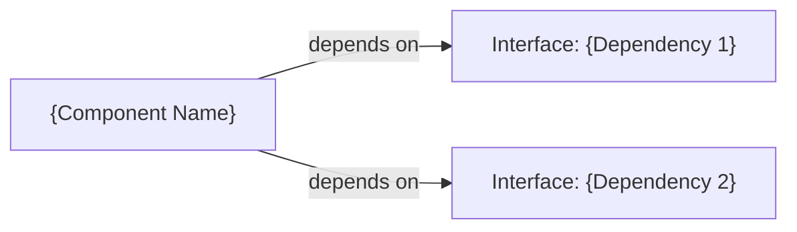

## 3. Component Design

### 3.1 Component Template

> Copy this block for each component:

#### Component: {Component Name}

| Attribute | Value |
|---|---|
| **Location** | `{src/path/to/module}` |
| **Responsibility** | {Single Responsibility description} |
| **SRS Requirements** | REQ-{MODULE}-{NNN}, REQ-{MODULE}-{NNN} |
| **Owner** | {Team / Agent} |

**Public Interface**:

```
class {ClassName}:
    def {method_1}({params}) -> {return_type}:
        """
        {Brief description}
        Preconditions: {What must be true before calling}
        Postconditions: {What is guaranteed after calling}
        Throws: {Exception types and when}
        """

    def {method_2}({params}) -> {return_type}:
        """..."""
```

**Internal Design**:
- **State Management**: {Stateless / Stateful — describe state lifecycle}
- **Concurrency Model**: {Single-threaded / Thread-safe / Actor-based}
- **Key Algorithms**: {Brief description of non-trivial algorithms used}

**Dependency Injection**:



---

### 3.2 Component: {First Component}

*(Use template from 3.1)*

### 3.3 Component: {Second Component}

*(Use template from 3.1)*
