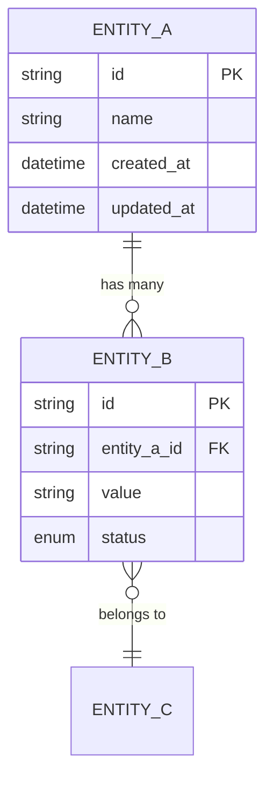
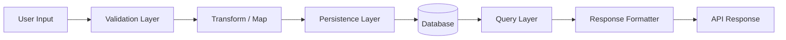

## 4. Data Design

### 4.1 Data Model (Entity Relationship)

### 4.2 Data Dictionary

| Entity | Field | Type | Constraints | Description |
|---|---|---|---|---|
| `{Entity}` | `{field}` | `{string / int / datetime}` | `{PK / FK / NOT NULL / UNIQUE}` | {Description} |

### 4.3 Data Flow

### 4.4 Migration Strategy

| Migration ID | Description | Reversible? | Dependencies |
|---|---|---|---|
| M-001 | {Initial schema creation} | Yes / No | None |
| M-002 | {Add index on {field}} | Yes | M-001 |

#### 4.4.1 Safe Migration Policy

> **MANDATORY**: All auto-generated migrations MUST comply with these safety rules.

**Prohibited DDL Commands** (agent-generated migrations MUST NOT contain):
- `DROP TABLE` / `DROP DATABASE` — Use `RENAME TO ..._deprecated` instead
- `TRUNCATE TABLE` — Use guarded `DELETE FROM ... WHERE {condition}`
- `DROP COLUMN` — Use add-new → migrate → deprecate-old pattern
- `DELETE FROM {table}` without `WHERE` clause

**Test Sandbox Requirement**:
- All migrations MUST be validated against a **memory database** (SQLite `:memory:` / H2) before execution
- Every migration MUST include a corresponding **reverse migration** script
- Agent MUST log the migration diff in `docs/cycle_logs/` before applying
