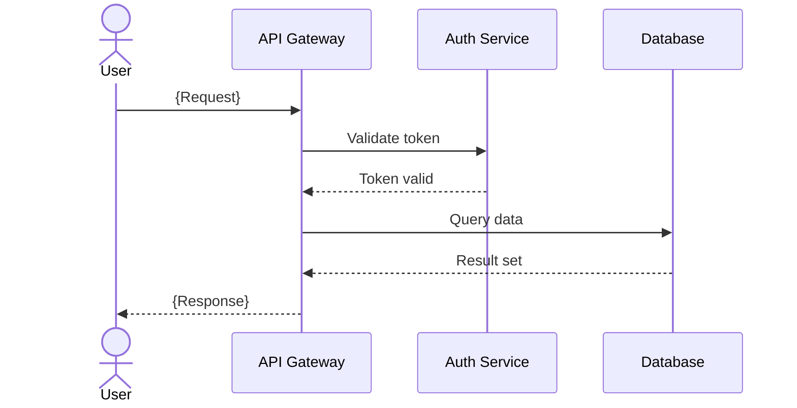
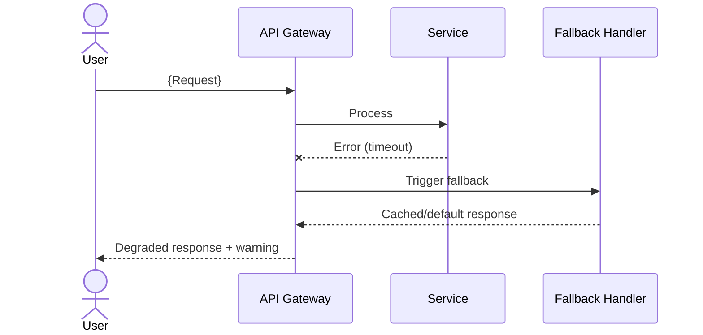

## 6. Sequence Diagrams (Critical Paths)

### 6.1 Critical Path: {Primary User Flow}

```mermaid
sequenceDiagram
    actor User
    participant API as API Gateway
    participant Auth as Auth Service
    participant DB as Database

    User->>API: {Request}
    API->>Auth: Validate token
    Auth-->>API: Token valid

    API->>DB: Query data
    DB-->>API: Result set

    API-->>User: {Response}
```

### 6.2 Critical Path: {Error Recovery Flow}

```mermaid
sequenceDiagram
    actor User
    participant API as API Gateway
    participant SVC as Service
    participant Fallback as Fallback Handler

    User->>API: {Request}
    API->>SVC: Process
    SVC--xAPI: Error (timeout)

    API->>Fallback: Trigger fallback
    Fallback-->>API: Cached/default response
    API-->>User: Degraded response + warning
```
