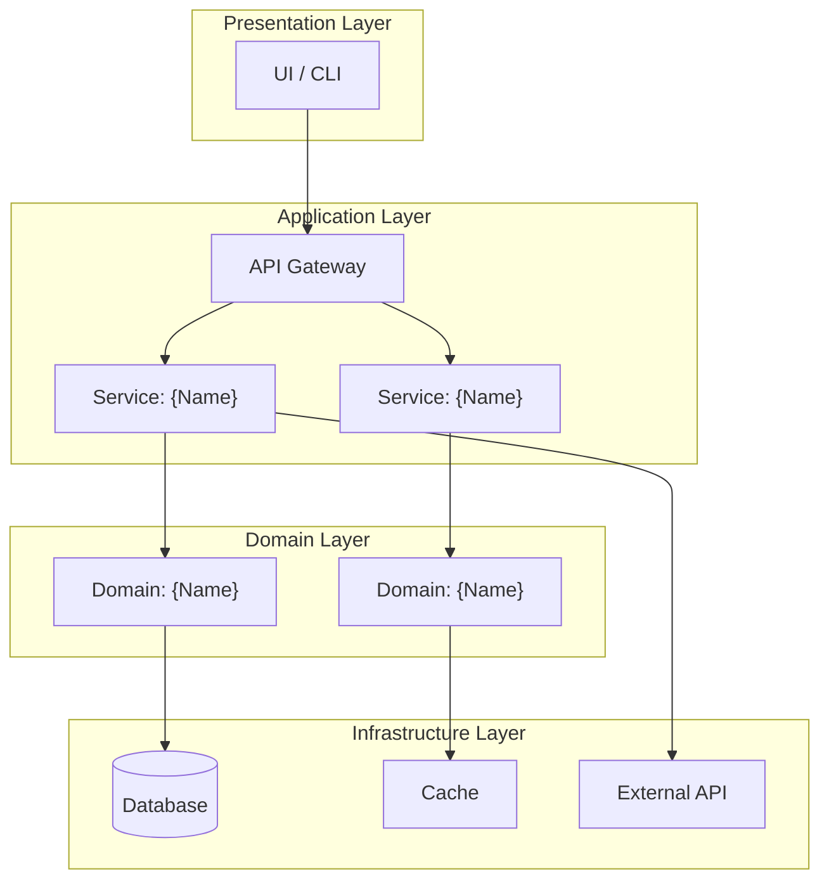

## 1. Introduction

### 1.1 Purpose

This document describes the software design and architecture of **{PROJECT_NAME}**, translating requirements from the [SRS](../specs/SRS.md) into implementable components, interfaces, and data structures.

### 1.2 Design Philosophy

State the core design principles guiding all decisions:

- **Principle 1**: {e.g., "Favor composition over inheritance"}
- **Principle 2**: {e.g., "Every module must be independently testable"}
- **Principle 3**: {e.g., "Fail fast, recover gracefully"}

### 1.3 Technology Stack

| Layer | Technology | Version | Justification (ADR Link) |
|---|---|---|---|
| **Runtime** | {Node.js / Python / Go} | {20.x / 3.11 / 1.22} | [ADR-001](../decisions/ADR-001.md) |
| **Framework** | {Express / FastAPI / Gin} | {4.x / 0.110 / 1.9} | [ADR-002](../decisions/ADR-002.md) |
| **Database** | {PostgreSQL / MongoDB / SQLite} | {16 / 7 / 3} | [ADR-003](../decisions/ADR-003.md) |
| **Test Runner** | {Jest / pytest / go test} | {29 / 8 / stdlib} | — |
| **Coverage Tool** | {c8 / coverage.py / go cover} | {latest} | Harness requires LCOV ≥ 80% |

---

## 2. Architecture Overview

### 2.1 System Architecture Diagram

### 2.2 Architecture Pattern

**Pattern**: {Layered / Microservices / Hexagonal / Event-Driven / Monolith}

**Rationale**: {Why this pattern was chosen. Reference ADR if available.}

**Boundaries**:
- **Presentation ↔ Application**: {REST API / GraphQL / gRPC}
- **Application ↔ Domain**: {Direct function calls / Message bus / Event queue}
- **Domain ↔ Infrastructure**: {Repository pattern / ORM / Direct queries}

### 2.3 Module Boundary Map

| Module | Responsibility | Allowed Dependencies | Forbidden Dependencies |
|---|---|---|---|
| `{module_name}` | {Single-sentence purpose} | {List of modules it CAN import} | {List of modules it MUST NOT import} |
