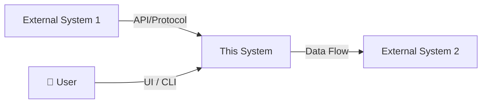

## 3. System Overview

### 3.1 System Context

Describe where this system fits within the larger ecosystem.

### 3.2 High-Level Architecture Summary

Provide a brief (3-5 sentence) description of the system architecture. Reference [SDD](../specs/SDD.md) for detailed design.

### 3.3 Operating Environment

| Aspect | Specification |
|---|---|
| **Platform** | {OS / Browser / Runtime} |
| **Language & Runtime** | {Node.js 20+ / Python 3.11+ / etc.} |
| **Dependencies** | {List critical external dependencies} |
| **Deployment Target** | {Local / Cloud (AWS, GCP) / Container} |
