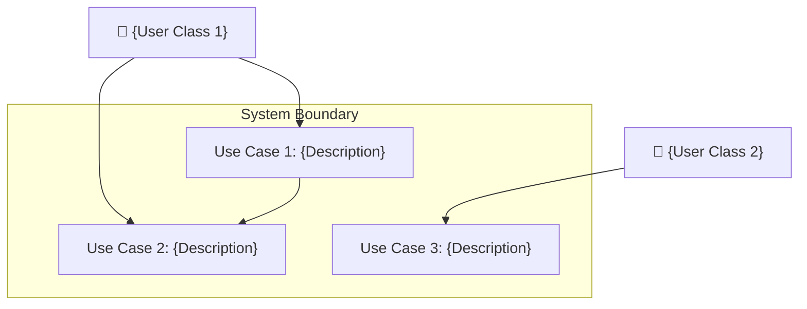

## 2. Stakeholders & User Classes

### 2.1 Stakeholder Registry

| Stakeholder | Role | Interest | Influence | Communication Channel |
|---|---|---|---|---|
| {Name/Team} | {Product Owner / Developer / End User / Ops} | {High / Medium / Low} | {High / Medium / Low} | {Slack / Email / JIRA} |

### 2.2 User Classes & Characteristics

| User Class | Description | Technical Proficiency | Frequency of Use | Priority |
|---|---|---|---|---|
| {Admin} | {System administrator managing configurations} | {High} | {Daily} | {Primary} |
| {End User} | {Consumer-facing user interacting with UI} | {Low-Medium} | {Daily} | {Primary} |
| {Agent (AI)} | {Autonomous agent executing harness tasks} | {N/A (Programmatic)} | {Continuous} | {Secondary} |

### 2.3 Use Case Diagram

