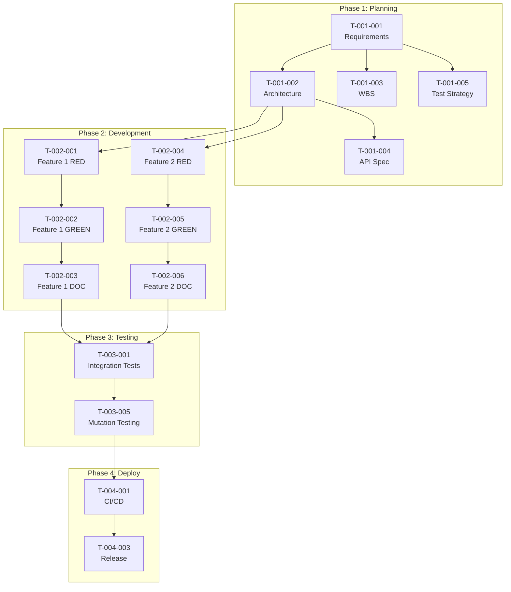
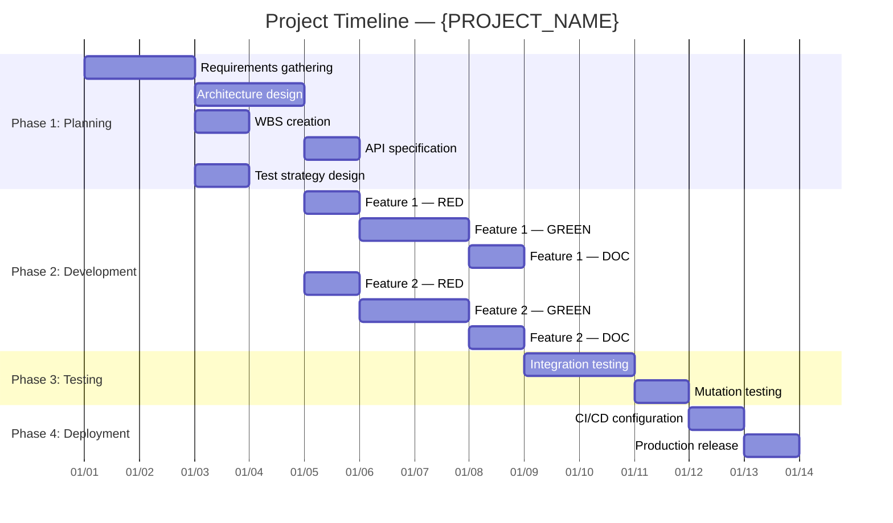

## 4. Dependency Graph

```mermaid
graph TD
    subgraph "Phase 1: Planning"
        T001_001["T-001-001<br>Requirements"]
        T001_002["T-001-002<br>Architecture"]
        T001_003["T-001-003<br>WBS"]
        T001_004["T-001-004<br>API Spec"]
        T001_005["T-001-005<br>Test Strategy"]
    end

    subgraph "Phase 2: Development"
        T002_001["T-002-001<br>Feature 1 RED"]
        T002_002["T-002-002<br>Feature 1 GREEN"]
        T002_003["T-002-003<br>Feature 1 DOC"]
        T002_004["T-002-004<br>Feature 2 RED"]
        T002_005["T-002-005<br>Feature 2 GREEN"]
        T002_006["T-002-006<br>Feature 2 DOC"]
    end

    subgraph "Phase 3: Testing"
        T003_001["T-003-001<br>Integration Tests"]
        T003_005["T-003-005<br>Mutation Testing"]
    end

    subgraph "Phase 4: Deploy"
        T004_001["T-004-001<br>CI/CD"]
        T004_003["T-004-003<br>Release"]
    end

    T001_001 --> T001_002
    T001_001 --> T001_003
    T001_002 --> T001_004
    T001_001 --> T001_005
    T001_002 --> T002_001
    T001_002 --> T002_004
    T002_001 --> T002_002
    T002_002 --> T002_003
    T002_004 --> T002_005
    T002_005 --> T002_006
    T002_003 --> T003_001
    T002_006 --> T003_001
    T003_001 --> T003_005
    T003_005 --> T004_001
    T004_001 --> T004_003
```

---

## 5. Gantt Chart

```mermaid
gantt
    title Project Timeline — {PROJECT_NAME}
    dateFormat  YYYY-MM-DD
    axisFormat  %m/%d

    section Phase 1: Planning
    Requirements gathering         :t001_001, 2026-01-01, 2d
    Architecture design            :t001_002, after t001_001, 2d
    WBS creation                   :t001_003, after t001_001, 1d
    API specification              :t001_004, after t001_002, 1d
    Test strategy design           :t001_005, after t001_001, 1d

    section Phase 2: Development
    Feature 1 — RED                :t002_001, after t001_002, 1d
    Feature 1 — GREEN              :t002_002, after t002_001, 2d
    Feature 1 — DOC                :t002_003, after t002_002, 0.5d
    Feature 2 — RED                :t002_004, after t001_002, 1d
    Feature 2 — GREEN              :t002_005, after t002_004, 2d
    Feature 2 — DOC                :t002_006, after t002_005, 0.5d

    section Phase 3: Testing
    Integration testing            :t003_001, after t002_003, 2d
    Mutation testing               :t003_005, after t003_001, 1d

    section Phase 4: Deployment
    CI/CD configuration            :t004_001, after t003_005, 1d
    Production release             :t004_003, after t004_001, 1d
```
